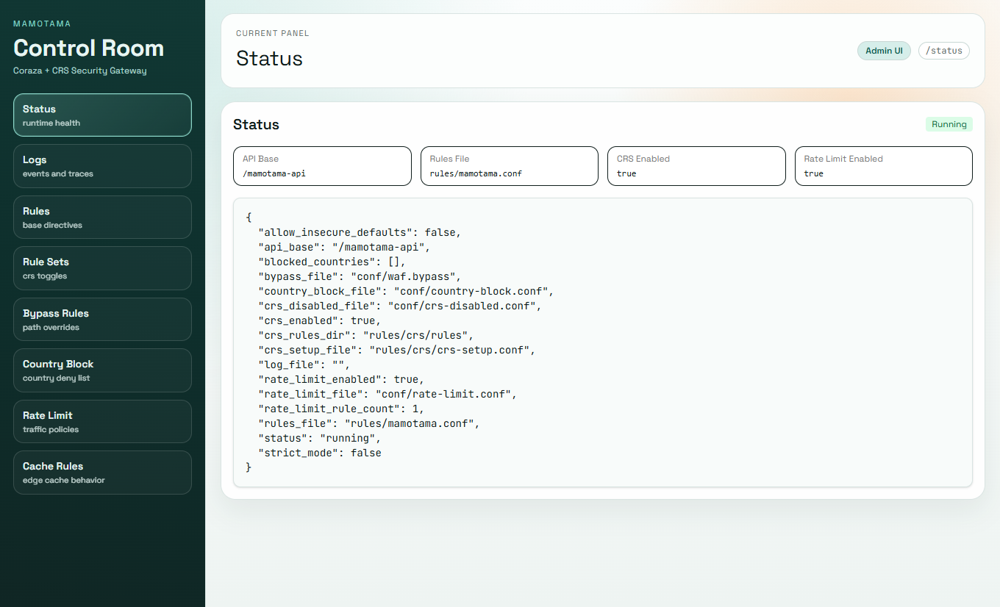
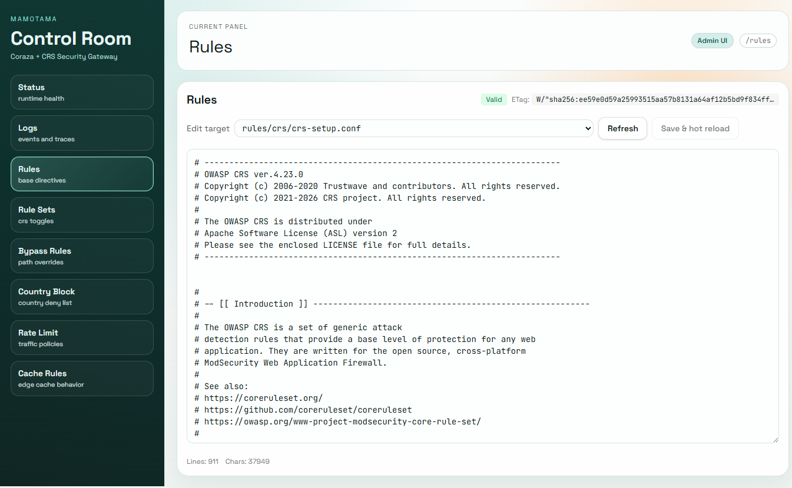
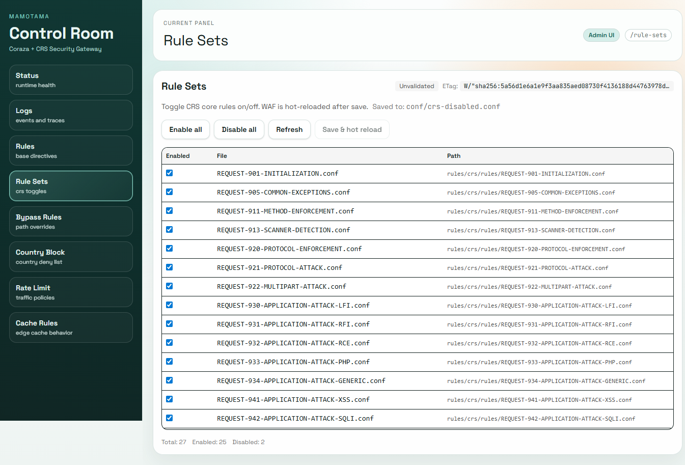
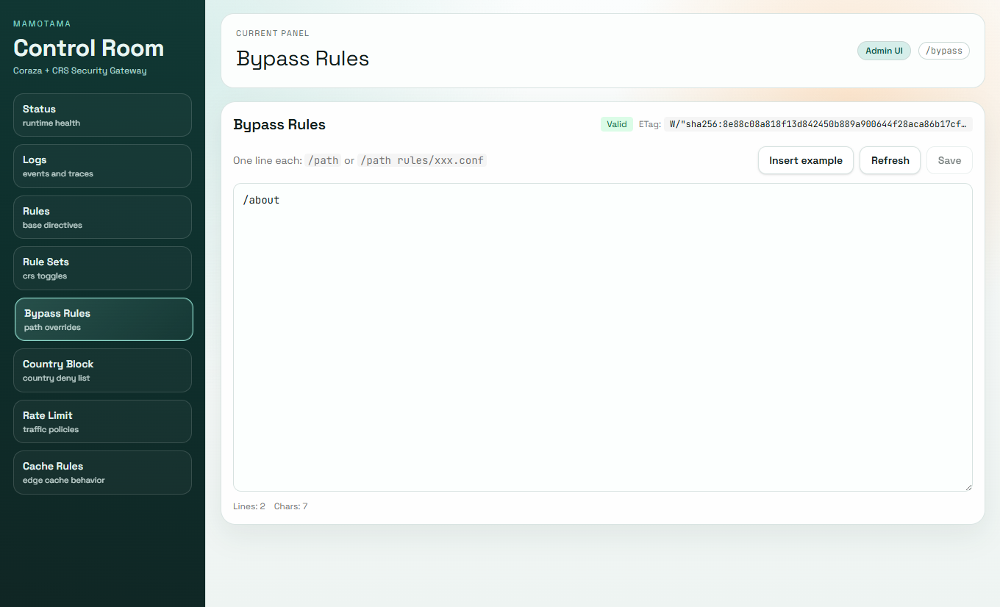
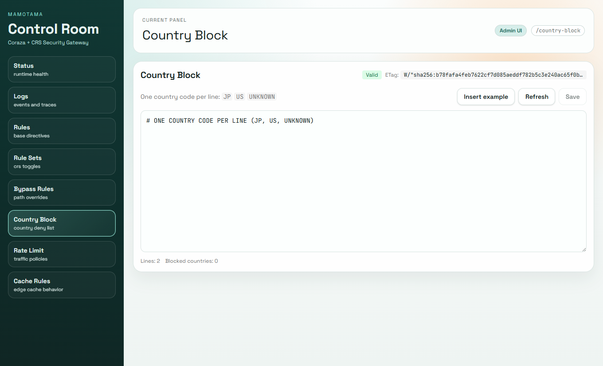
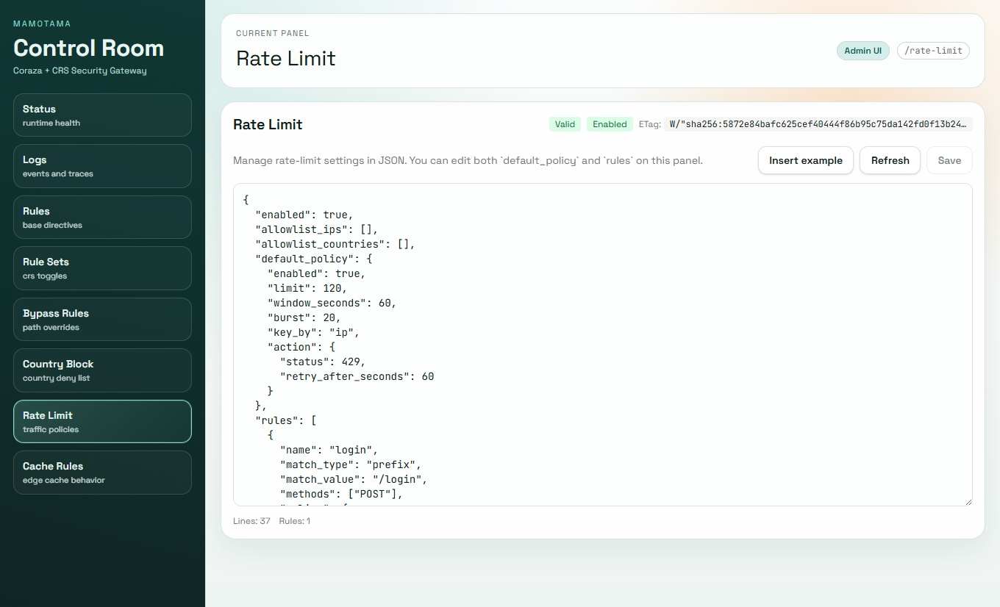
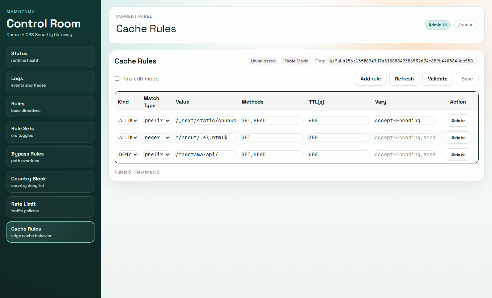
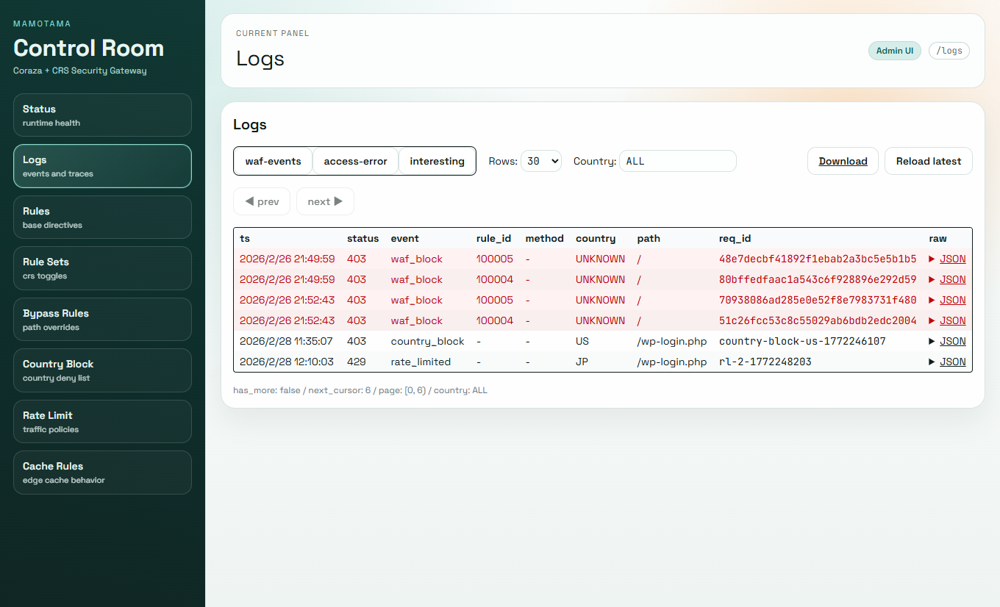

# mamotama

Coraza + CRS WAF project

[English](README.md) | [Japanese](README.ja.md)



## Overview

`mamotama` is a lightweight yet powerful application protection stack built with Coraza WAF and OWASP Core Rule Set (CRS).

---

## About Rule Files

To comply with licensing, this repository does **not** bundle the full OWASP CRS files.
Instead, it includes a minimal bootstrappable base rule file: `data/rules/mamotama.conf`.

### Setup

Fetch and place CRS files with the following script (default: `v4.23.0`):

```bash
./scripts/install_crs.sh
```

Specify a version:

```bash
./scripts/install_crs.sh v4.23.0
```

Edit `data/rules/crs/crs-setup.conf` as needed (for example, paranoia level and anomaly score settings).

---

## Environment Variables

You can control behavior via `.env`.

### Nginx (OpenResty)

| Variable | Example | Description |
| --- | --- | --- |
| `NGX_CORAZA_UPSTREAM` | `server coraza:9090;` | Upstream definition for Coraza (Go server). You can list multiple `server host:port;` lines for simple load balancing. |
| `NGX_BACKEND_RESPONSE_TIMEOUT` | `60s` | Upstream response timeout from Coraza. Applied to `proxy_read_timeout`. |
| `NGX_CORAZA_ADMIN_URL` | `/mamotama-admin/` | Public path for admin UI. Trailing slash required. Requests under this path are proxied to frontend (`web:5173`). |
| `NGX_CORAZA_API_BASEPATH` | `/mamotama-api/` | Base path for admin API. Trailing slash recommended. This path is always non-cacheable on nginx side. |

### WAF / Go (Coraza Wrapper)

| Variable | Example | Description |
| --- | --- | --- |
| `WAF_APP_URL` | `http://host.docker.internal:3000` | Upstream application URL (change appropriately for production such as ALB/ECS). |
| `WAF_LOG_FILE` | (empty) | WAF log output destination. If empty, stdout is used. |
| `WAF_BYPASS_FILE` | `conf/waf.bypass` | Path for bypass/special-rule definition file. |
| `WAF_BOT_DEFENSE_FILE` | `conf/bot-defense.conf` | Bot-defense challenge settings file (JSON), editable from admin UI. |
| `WAF_SEMANTIC_FILE` | `conf/semantic.conf` | Semantic heuristic scoring settings file (JSON), editable from admin UI. |
| `WAF_COUNTRY_BLOCK_FILE` | `conf/country-block.conf` | Country block definition file (one country code per line, e.g. `JP`, `US`, `UNKNOWN`). |
| `WAF_RATE_LIMIT_FILE` | `conf/rate-limit.conf` | Rate-limit definition file (JSON), editable from admin UI. |
| `WAF_RULES_FILE` | `rules/mamotama.conf` | Active base rule file(s). Comma-separated multiple files are supported. |
| `WAF_CRS_ENABLE` | `true` | Whether to load CRS. If `false`, only base rules are used. |
| `WAF_CRS_SETUP_FILE` | `rules/crs/crs-setup.conf` | CRS setup file path. |
| `WAF_CRS_RULES_DIR` | `rules/crs/rules` | Directory for CRS core rules (`*.conf`). |
| `WAF_CRS_DISABLED_FILE` | `conf/crs-disabled.conf` | Disabled CRS core rule list file (one filename per line). |
| `WAF_FP_TUNER_MODE` | `mock` | FP tuner provider mode. `mock` reads fixture or generated suggestion, `http` posts to `WAF_FP_TUNER_ENDPOINT`. |
| `WAF_FP_TUNER_ENDPOINT` | (empty) | HTTP endpoint for external LLM proxy in `http` mode. |
| `WAF_FP_TUNER_API_KEY` | (empty) | Bearer token for `WAF_FP_TUNER_ENDPOINT`. |
| `WAF_FP_TUNER_MODEL` | (empty) | Optional model label passed to provider payload. |
| `WAF_FP_TUNER_TIMEOUT_SEC` | `15` | HTTP timeout (seconds) for provider calls. |
| `WAF_FP_TUNER_MOCK_RESPONSE_FILE` | `conf/fp-tuner-mock-response.json` | Mock provider response fixture path used in `mock` mode. |
| `WAF_FP_TUNER_REQUIRE_APPROVAL` | `true` | Require approval token for non-simulated apply (`/fp-tuner/apply` with `simulate=false`). |
| `WAF_FP_TUNER_APPROVAL_TTL_SEC` | `600` | Approval token TTL in seconds. |
| `WAF_FP_TUNER_AUDIT_FILE` | `logs/coraza/fp-tuner-audit.ndjson` | Audit log destination for propose/apply actions. |
| `WAF_STRICT_OVERRIDE` | `false` | Behavior when a special-rule file fails to load. `true`: fail fast. `false`: warn and continue. |
| `WAF_API_BASEPATH` | `/mamotama-api` | Base path for admin API routing on Go server. |
| `WAF_API_KEY_PRIMARY` | `...` | Primary admin API key (`X-API-Key`). |
| `WAF_API_KEY_SECONDARY` | (empty) | Secondary key for rotation/fallback. Leave empty if unused. |
| `WAF_API_AUTH_DISABLE` | (empty) | Disable API auth flag. Keep empty (false) in production; use only for test environments. |
| `WAF_API_CORS_ALLOWED_ORIGINS` | `https://admin.example.com,http://localhost:5173` | Allowed CORS origins (comma-separated). If empty, CORS is disabled (same-origin only). |
| `WAF_ALLOW_INSECURE_DEFAULTS` | (empty) | Dev-only flag to allow weak API keys or disabled auth. Do not set in production. |

### Admin UI (React / Vite)

| Variable | Example | Description |
| --- | --- | --- |
| `VITE_CORAZA_API_BASE` | `http://localhost/mamotama-api` | Full/relative API base path used by browser-side calls. |
| `VITE_APP_BASE_PATH` | `/mamotama-admin` | Admin UI root path (`react-router` basename). |
| `VITE_API_KEY` | `...` | API key attached by admin UI (`X-API-Key`). Usually same as `WAF_API_KEY_PRIMARY`. |

At startup, if `WAF_API_KEY_PRIMARY` is too short or known-weak, Coraza fails to start in secure mode.
For local testing only, you can temporarily relax this with `WAF_ALLOW_INSECURE_DEFAULTS=1`.

---

## Admin Dashboard

`web/mamotama-admin/` contains the admin UI built with React + Vite.


### Main Screens and Features

| Path | Description |
| --- | --- |
| `/status` | WAF runtime status and configuration overview |
| `/logs` | Fetch and view WAF logs |
| `/rules` | View/edit active base rule files |
| `/rule-sets` | Enable/disable CRS core rule files (`rules/crs/rules/*.conf`) |
| `/bypass` | View/edit bypass config directly (`waf.bypass`) |
| `/country-block` | View/edit country block config directly (`country-block.conf`) |
| `/rate-limit` | View/edit rate-limit config directly (`rate-limit.conf`) |
| `/bot-defense` | View/edit bot-defense config directly (`bot-defense.conf`) |
| `/semantic` | View/edit semantic security config directly (`semantic.conf`) |
| `/cache-rules` | Visual + raw editing for cache rules (`cache.conf`), with Validate/Save |

### Screenshots

#### Dashboard


#### Rules Editor


#### Rule Sets


#### Bypass Rules


#### Country Block


#### Rate Limit


#### Cache Rules


#### Logs


### Libraries

- coraza 3.3.3
- openresty 1.27
- go 1.25.7
- React 19
- Vite 7
- Tailwind CSS
- react-router-dom
- ShadCN UI (Tailwind-based UI)

### Startup

```bash
./scripts/install_crs.sh
docker compose build coraza openresty
docker compose up web
docker compose up -d coraza openresty
```

You can change the root path by setting `VITE_APP_BASE_PATH` and `VITE_CORAZA_API_BASE` in `.env`.

### WAF Regression Test (GoTestWAF)

Run the local regression test:

```bash
./scripts/run_gotestwaf.sh
```

Prerequisites:

- Docker and Docker Compose are available.
- The script automatically builds/starts `coraza` and `openresty`.
- Default host ports are `HOST_CORAZA_PORT=19090` and `HOST_OPENRESTY_PORT=18080`.
- The first run may take longer because the GoTestWAF image is pulled.

Default gate is `MIN_BLOCKED_RATIO=70`. Optional extra gates:

```bash
MIN_TRUE_NEGATIVE_PASSED_RATIO=95 MAX_FALSE_POSITIVE_RATIO=5 MAX_BYPASS_RATIO=30 ./scripts/run_gotestwaf.sh
```

Reports are written to `data/logs/gotestwaf/`:

- JSON full report: `gotestwaf-report.json`
- Markdown summary: `gotestwaf-report-summary.md`
- Key-value summary: `gotestwaf-report-summary.txt`

### Deployment Examples

Practical example stacks are available under:

- `examples/nextjs` (Next.js frontend)
- `examples/wordpress` (WordPress + high-paranoia CRS setup)
- `examples/api-gateway` (REST API + strict rate-limit profile)

See `examples/README.md` for common setup flow.

### FP Tuner Mock Flow

You can test send/receive/apply flow without an external LLM contract:

```bash
./scripts/test_fp_tuner_mock.sh
```

Default is simulate-only apply (`SIMULATE=1`). To actually append and hot-reload:

```bash
SIMULATE=0 ./scripts/test_fp_tuner_mock.sh
```

---

## Admin API Endpoints (`/mamotama-api`)

### Endpoint List

| Method | Path | Description |
| --- | --- | --- |
| GET | `/mamotama-api/status` | Get current WAF status/config |
| GET | `/mamotama-api/logs/read` | Read WAF logs (`tail`) with optional country filter via `country` query |
| GET | `/mamotama-api/logs/download` | Download log files (`waf` / `accerr` / `intr`) as ZIP |
| GET | `/mamotama-api/rules` | Get active rule files (multi-file aware) |
| POST | `/mamotama-api/rules:validate` | Validate rule syntax (no save) |
| PUT | `/mamotama-api/rules` | Save rule file and hot-reload base WAF (`If-Match` supported) |
| GET | `/mamotama-api/crs-rule-sets` | Get CRS rule list and enabled/disabled state |
| POST | `/mamotama-api/crs-rule-sets:validate` | Validate CRS selection (no save) |
| PUT | `/mamotama-api/crs-rule-sets` | Save CRS selection and hot-reload (`If-Match` supported) |
| GET | `/mamotama-api/bypass-rules` | Get bypass file content |
| POST | `/mamotama-api/bypass-rules:validate` | Validate bypass content only (no save) |
| PUT | `/mamotama-api/bypass-rules` | Save bypass file (`If-Match` optimistic lock via `ETag`) |
| GET | `/mamotama-api/country-block-rules` | Get country block file content |
| POST | `/mamotama-api/country-block-rules:validate` | Validate country block file (no save) |
| PUT | `/mamotama-api/country-block-rules` | Save country block file (`If-Match` optimistic lock via `ETag`) |
| GET | `/mamotama-api/rate-limit-rules` | Get rate-limit config file |
| POST | `/mamotama-api/rate-limit-rules:validate` | Validate rate-limit config (no save) |
| PUT | `/mamotama-api/rate-limit-rules` | Save rate-limit config (`If-Match` optimistic lock via `ETag`) |
| GET | `/mamotama-api/bot-defense-rules` | Get bot-defense config file |
| POST | `/mamotama-api/bot-defense-rules:validate` | Validate bot-defense config (no save) |
| PUT | `/mamotama-api/bot-defense-rules` | Save bot-defense config (`If-Match` optimistic lock via `ETag`) |
| GET | `/mamotama-api/semantic-rules` | Get semantic security config and runtime stats |
| POST | `/mamotama-api/semantic-rules:validate` | Validate semantic config (no save) |
| PUT | `/mamotama-api/semantic-rules` | Save semantic config (`If-Match` optimistic lock via `ETag`) |
| POST | `/mamotama-api/fp-tuner/propose` | Build FP tuning proposal from request payload or latest `waf_block` log event |
| POST | `/mamotama-api/fp-tuner/apply` | Validate/apply proposed scoped exclusion rule (`simulate=true` by default, approval token required for real apply when enabled) |
| GET | `/mamotama-api/cache-rules` | Return `cache.conf` raw + structured data with `ETag` |
| POST | `/mamotama-api/cache-rules:validate` | Validate cache config (no save) |
| PUT | `/mamotama-api/cache-rules` | Save `cache.conf` (`If-Match` optimistic lock via `ETag`) |

If logs or rules are missing, API returns `500` with `{"error":"..."}`.

---

## WAF Bypass / Special Rule Settings

`mamotama` supports request-level WAF bypass and path-specific special rule application.

### Bypass File Location

Specify with environment variable `WAF_BYPASS_FILE` (default: `conf/waf.bypass`).

### File Format

```text
# Normal bypass entries
/about/
/about/user.php

# Special rule application (do not bypass WAF; apply the given rule file)
/about/admin.php rules/admin-rule.conf

# Comment lines (starting with #)
#/should/be/ignored.php rules/test.conf
```

### Edit from UI

You can directly edit and save `waf.bypass` from dashboard `/bypass`.

### Country Block Settings

You can edit `WAF_COUNTRY_BLOCK_FILE` (default: `conf/country-block.conf`) from `/country-block`.
Use one country code per line (`JP`, `US`, `UNKNOWN`).
Matched countries are blocked with `403` before WAF inspection.

### Rate Limit Settings

You can edit `WAF_RATE_LIMIT_FILE` (default: `conf/rate-limit.conf`) from `/rate-limit`.
Configuration format is JSON with `default_policy` and `rules`.
On exceed, response uses `action.status` (typically `429`) and includes `Retry-After` header.

#### JSON Parameter Quick Reference (what changes what)

| Parameter | Example | Effect |
| --- | --- | --- |
| `enabled` | `true` / `false` | Enables/disables rate limit globally. `false` means pass-through. |
| `allowlist_ips` | `["127.0.0.1/32", "10.0.0.5"]` | Always exempt matching IP/CIDR from rate limiting. |
| `allowlist_countries` | `["JP", "US"]` | Always exempt matching country codes. |
| `default_policy.enabled` | `true` | Enable/disable default policy itself. |
| `default_policy.limit` | `120` | Base allowed requests per window. |
| `default_policy.burst` | `20` | Additional burst allowance. Effective cap is `limit + burst`. |
| `default_policy.window_seconds` | `60` | Window size in seconds. Smaller is stricter. |
| `default_policy.key_by` | `"ip"` | Aggregation key: `ip` / `country` / `ip_country`. |
| `default_policy.action.status` | `429` | HTTP status on exceed (`4xx`/`5xx`). |
| `default_policy.action.retry_after_seconds` | `60` | `Retry-After` value in seconds. If `0`, remaining window time is auto-calculated. |
| `rules[]` | see below | Overrides `default_policy` when matched. Evaluated top-down. |
| `rules[].match_type` | `"prefix"` | Match type: `exact` / `prefix` / `regex`. |
| `rules[].match_value` | `"/login"` | Match target according to type. |
| `rules[].methods` | `["POST"]` | Restrict methods. Empty means all methods. |
| `rules[].policy.*` |  | Policy fields used when this rule matches. |

#### Typical Tuning

- Temporarily disable globally: set `enabled=false`
- Improve spike tolerance: increase `burst`
- Tighten login path: add a rule with `match_type=prefix`, `match_value=/login`, `methods=["POST"]`
- Separate by IP + country: set `key_by="ip_country"`
- Exempt trusted locations: add to `allowlist_ips` or `allowlist_countries`

### Bot Defense Settings

You can edit `WAF_BOT_DEFENSE_FILE` (default: `conf/bot-defense.conf`) from `/bot-defense`.
When enabled, suspicious (or all, depending on mode) browser-like GET requests on matched paths receive a challenge response before WAF inspection.

#### JSON Parameter Quick Reference

| Parameter | Example | Effect |
| --- | --- | --- |
| `enabled` | `true` / `false` | Enables/disables bot challenge globally. |
| `mode` | `"suspicious"` | `suspicious` checks UA patterns, `always` challenges all matched requests. |
| `path_prefixes` | `["/", "/login"]` | Apply challenge only to matching request paths. |
| `exempt_cidrs` | `["127.0.0.1/32"]` | Skip challenge for trusted source IP/CIDR. |
| `suspicious_user_agents` | `["curl", "wget"]` | UA substrings used in `suspicious` mode. |
| `challenge_cookie_name` | `"__mamotama_bot_ok"` | Cookie name used for challenge pass state. |
| `challenge_secret` | `"long-random-secret"` | Signing secret for challenge token (empty = ephemeral per process). |
| `challenge_ttl_seconds` | `86400` | Token validity period in seconds. |
| `challenge_status_code` | `429` | HTTP status returned on challenge response (`4xx/5xx`). |

### Semantic Security Settings

You can edit `WAF_SEMANTIC_FILE` (default: `conf/semantic.conf`) from `/semantic`.
This is a heuristic detector (rule-based, non-ML) with staged enforcement: `off | log_only | challenge | block`.

#### JSON Parameter Quick Reference

| Parameter | Example | Effect |
| --- | --- | --- |
| `enabled` | `true` / `false` | Enables/disables semantic scoring pipeline. |
| `mode` | `"challenge"` | Enforcement stage: `off` / `log_only` / `challenge` / `block`. |
| `exempt_path_prefixes` | `["/healthz"]` | Skip semantic scoring for matching paths. |
| `log_threshold` | `4` | Minimum score to emit semantic anomaly log. |
| `challenge_threshold` | `7` | Minimum score to issue semantic challenge in `challenge` mode. |
| `block_threshold` | `9` | Minimum score to hard-block (`403`) in `block` mode. |
| `max_inspect_body` | `16384` | Max request body bytes inspected by semantic scoring. |

### Rule File Editing (multi-file aware)

Dashboard `/rules` edits active base rule set (`WAF_RULES_FILE` and, when CRS enabled, `crs-setup.conf` + enabled `*.conf` under `WAF_CRS_RULES_DIR`).
Before save, server-side syntax validation is performed. Successful save hot-reloads base WAF.
If reload fails, automatic rollback is applied.

### CRS Rule Set Toggle

Dashboard `/rule-sets` toggles each file under `rules/crs/rules/*.conf`.
State is persisted to `WAF_CRS_DISABLED_FILE` and WAF is hot-reloaded on save.

### Priority

- Special-rule entries take precedence (bypass entries on same path are ignored)
- If rule file does not exist:
  - `WAF_STRICT_OVERRIDE=true`: fail immediately (`log.Fatalf`)
  - `false` or unset: log warning and continue with normal rules

### Example

```text
/about/                    # bypass everything under /about/
/about/admin.php rules/special.conf  # only admin.php uses special rule via WAF
```

### Notes

- Rules are evaluated top-to-bottom in file order
- Lines with `extraRuleFile` are prioritized
- Comment lines (`#...`) are ignored

---

## Log Retrieval

Logs are available via API.

```bash
curl -s -H "X-API-Key: <your-api-key>" \
     "http://<host>/mamotama-api/logs/read?src=waf&tail=100&country=JP" | jq .
```

- `src`: log type (`waf`, `accerr`, `intr`)
- `tail`: number of lines
- `country`: country code filter (`JP`, `US`, `UNKNOWN`). Omit or set `ALL` for all records.
  - Under Cloudflare, `CF-IPCountry` header is used. If unavailable, `UNKNOWN` is used.

Use the API key configured in `.env`.
For production, always enforce access controls and authentication.

## Cache Feature

You can dynamically configure cache target paths and TTL.

### Config File

Cache config is stored in `/data/conf/cache.conf`.
Hot reload is supported; changes apply right after saving the file.

#### Example

```bash
# Cache static assets (CSS/JS/images) for 10 minutes
ALLOW prefix=/_next/static/chunks/ methods=GET,HEAD ttl=600 vary=Accept-Encoding

# Cache specific HTML pages for 5 minutes (regex)
ALLOW regex=^/about/.*.html$ methods=GET ttl=300

# Deny cache for all API paths (safe default)
DENY prefix=/mamotama-api/

# Deny cache for authenticated user profile pages (regex)
DENY regex=^/users/[0-9]+/profile

# Everything else defaults to non-cache
```

- `ALLOW`: cache enabled (`ttl` in seconds, optional `vary`)
- `DENY`: excluded from cache
- Recommended methods are `GET`/`HEAD` (`POST` etc. are not cached)

Field details:
- `prefix`: match request path prefix
- `regex`: regex match (`^` and `$` supported)
- `methods`: target HTTP methods (comma-separated)
- `ttl`: cache duration in seconds
- `vary`: `Vary` header values for nginx (comma-separated)

### Behavior Summary

- Go side sets `X-Mamotama-Cacheable` and `X-Accel-Expires` on responses matching cache rules
- nginx controls cache based on those headers
- Requests with auth headers, cookies, or API paths are non-cacheable by default
- Upstream responses containing `Set-Cookie` are not stored (to prevent shared-cache leakage)

### How to Verify

Check response headers:
- `X-Mamotama-Cacheable: 1`
- `X-Accel-Expires: <seconds>`

You can inspect cache hit state using nginx `X-Cache-Status` header (`MISS`/`HIT`/`BYPASS`, etc.).

---

## Admin UI Access Restrictions

This project does not include access control by default.
If you expose admin UI (`NGX_CORAZA_ADMIN_URL`), always configure access controls such as Basic Auth and/or IP restrictions.

---

## Quality Gates (CI)

GitHub Actions workflow `ci` validates:

- `go test ./...` (`coraza/src`)
- `docker compose config` sanity check
- `./scripts/run_gotestwaf.sh` (`waf-test` job, `MIN_BLOCKED_RATIO=70`)

In production workflows, set these as required branch protection checks:

- `ci / go-test`
- `ci / compose-validate`
- `ci / waf-test`

---

## False Positive Tuning

See:

- `docs/operations/waf-tuning.md`
- `docs/operations/fp-tuner-api.md`

---

## Disclaimer

This project is primarily intended for security learning and validation.
Before production use, perform sufficient evaluation and tuning for your environment.
